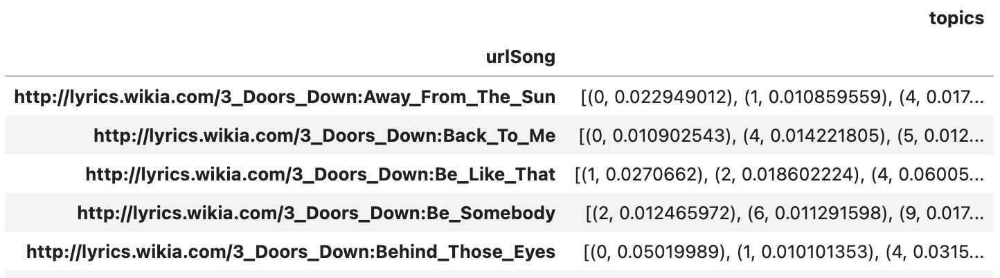
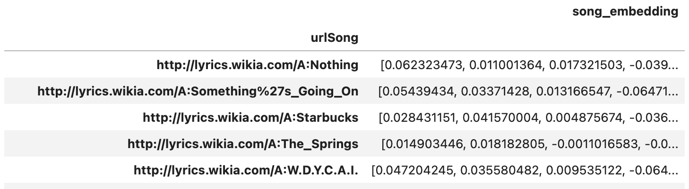

# EvalRS-KDD-2023
Official Repository for EvalRS @ KDD 2023, the Second Edition of the workshop on well-rounded evaluation of recommender systems.

<a href="https://colab.research.google.com/drive/1QeXglfCUEcscHB6L0Gch2qDKDDlfwLlq?usp=sharing">   </a>

[//]: # (TODO: we really need a new image!)


## Status

_The repository is mostly stable (i.e. you can start hacking!), but check back often for additional material and tools, and possibly minor modifications to the sample code!_

## Quick Start

| Name            | Link     | 
|-----------------|----------|
| Tutorial 1 - Exploring the EvalRS Dataset | [](https://colab.research.google.com/drive/1VXmCpL0YkLkf5_GTgJmLtd2b2A57CNjm?usp=sharing)|
| Tutorial 2 - A Dummy Model In RecList on the EvalRS Dataset  | [](https://colab.research.google.com/drive/1QeXglfCUEcscHB6L0Gch2qDKDDlfwLlq?usp=sharing)|
| Tutorial 3 - A Song Embedding Model on the EvalRS Dataset | [](https://colab.research.google.com/drive/1hZJj5akr1cMP3QWWKXvD0MNoX4GimNb7?usp=sharing)|
| Appendix - How to Write a RecList | [](https://colab.research.google.com/drive/1GVsVB1a3H9qbRQvwtb0TBDxq8A5nXc5w?usp=sharing)|


## Overview

This is the official repository for [EvalRS @ KDD 2023](https://reclist.io/kdd2023-cup/): _a Well-Rounded Evaluation of Recommender Systems_.

Aside from papers and talks, we will host a hackathon, where participants will pursue innovative projects for the rounded evaluation of recommender systems. The aim of the hackathon is to evaluate recommender systems across a set of important dimensions (accuracy being _one_ of them) through a principled and re-usable set of abstractions, as provided by [RecList](https://github.com/jacopotagliabue/reclist) 🚀. At the end of the workshop, organizers will sponsor a social event for teams to finalize their projects, mingle with like-minded practitioners and received the monetary prizes for best papers and projects: a link to the event will be added soon!

This repository provides an open dataset and all the tools necessary to partecipate in the hackathon: everything will go back to the community as open-source contributions. Please refer to the appropriate sections below to know how to get the dataset and run the evaluation loop properly.

### Important dates

Check the [EvalRS website](https://reclist.io/kdd2023-cup/) for the official timeline, including the start date, paper submission, and workshop schedule.

### Quick links

* 🛖 [EvalRS website](https://reclist.io/kdd2023-cup/)
* 📚 [EvalRS paper](https://arxiv.org/abs/2304.07145)
* 📖 [RecList website](https://reclist.io/)


## Dataset and target scenario

This hackathon is based on the [LFM-1b Dataset, Corpus of Music Listening Events for Music Recommendation](http://www.cp.jku.at/datasets/LFM-1b/). The use case is a typical user-item recommendation scenario: at _prediction time_, we get a set of users: for each user, our model recommends a set of songs to listen to, based on historical data on previous music consumption.

We picked LFM as it suits the spirit and the goal of this event: in particular, thanks to [rich meta-data on users](http://www.cp.jku.at/people/schedl/Research/Publications/pdf/schedl_ijmir_2017.pdf), the dataset allows us to test recommender systems among many non-obvious dimensions, on top of standard Information Retrieval Metrics (for the philosophy behind behavioral testing, please refer to the original [RecList paper](https://arxiv.org/abs/2111.09963)).

Importantly, the dataset of this workshop is a _new_, augmented version of the one used [last year at CIKM](https://github.com/RecList/evalRS-CIKM-2022): to provide richer [item meta-data](https://arxiv.org/abs/1912.02477), we extended the LFM-1b dataset with content-based features and user-provided labels from the [WASABI dataset](https://github.com/micbuffa/WasabiDataset) (see below).

### Data overview

When you run the evaluation loop below, the code will automatically download _a chosen subset of the LFM dataset_, ready to be used (the code will download it only the first time you run it). There are three main objects available from the provided evaluation class:

_Users_: a collection of users and available meta-data, including patterns of consumption, demographics etc. In the Data Challenge scenario, the user Id is the query item for the model, which is asked to recommend songs to the user.


_Tracks_: a collection of tracks and available meta-data. In the Data Challenge scenario, tracks are the target items for the model, i.e. the collection to choose from when the model needs to provide recommendations.


_Historical Interactions_: a collection of interactions between users and tracks, that is, listening events, which should be used by your model to build the recommender system for the Data Challenge.


To enrich track-related metadata, four addditional objects are provided holding features derived from the WASABI dataset:

_Social and Emotion Tags_: a collection of social tags and emotion tags collected on last.fm, together with a weight that expresses how much they have been used for a given song.


_Topics_: a collection of 60-dimensional sparse descriptors representing the topic distribution of a LDA topic model trained on English lyrics (model is available [here](https://github.com/micbuffa/WasabiDataset/)).





_Song Embeddings_: 768-dimensional SentenceBERT embeddings calculated, using the `all-mpnet-base-v2` pretrained model, on song lyrics. For each of the tracks for which lyrics were available (47% of the total number of unique songs), both embeddings calculated on the full *song* and concatenation of embeddings calculated on individual *verses* are available.




**NOTE** that verse embeddings are quite **large** (~35GB) so they are stored as multiple parquet files, split by initial letter of band name (see an example on how to load the embeddings [here](notebooks/eda-on-the-evalrs-dataset.ipynb)). 

If you want to use them in your model, you can download them manually from the following links:
[
[3](https://evalrs.object.lga1.coreweave.com/evalrs_verse_embeddings_3.parquet)
[5](https://evalrs.object.lga1.coreweave.com/evalrs_verse_embeddings_5.parquet)
[A](https://evalrs.object.lga1.coreweave.com/evalrs_verse_embeddings_A.parquet)
[B](https://evalrs.object.lga1.coreweave.com/evalrs_verse_embeddings_B.parquet)
[C](https://evalrs.object.lga1.coreweave.com/evalrs_verse_embeddings_C.parquet)
[D](https://evalrs.object.lga1.coreweave.com/evalrs_verse_embeddings_D.parquet)
[E](https://evalrs.object.lga1.coreweave.com/evalrs_verse_embeddings_E.parquet)
[F](https://evalrs.object.lga1.coreweave.com/evalrs_verse_embeddings_F.parquet)
[G](https://evalrs.object.lga1.coreweave.com/evalrs_verse_embeddings_G.parquet)
[H](https://evalrs.object.lga1.coreweave.com/evalrs_verse_embeddings_H.parquet)
[I](https://evalrs.object.lga1.coreweave.com/evalrs_verse_embeddings_I.parquet)
[J](https://evalrs.object.lga1.coreweave.com/evalrs_verse_embeddings_J.parquet)
[K](https://evalrs.object.lga1.coreweave.com/evalrs_verse_embeddings_K.parquet)
[L](https://evalrs.object.lga1.coreweave.com/evalrs_verse_embeddings_L.parquet)
[M](https://evalrs.object.lga1.coreweave.com/evalrs_verse_embeddings_M.parquet)
[N](https://evalrs.object.lga1.coreweave.com/evalrs_verse_embeddings_N.parquet)
[O](https://evalrs.object.lga1.coreweave.com/evalrs_verse_embeddings_O.parquet)
[P](https://evalrs.object.lga1.coreweave.com/evalrs_verse_embeddings_P.parquet)
[Q](https://evalrs.object.lga1.coreweave.com/evalrs_verse_embeddings_Q.parquet)
[R](https://evalrs.object.lga1.coreweave.com/evalrs_verse_embeddings_R.parquet)
[S](https://evalrs.object.lga1.coreweave.com/evalrs_verse_embeddings_S.parquet)
[T](https://evalrs.object.lga1.coreweave.com/evalrs_verse_embeddings_T.parquet)
[U](https://evalrs.object.lga1.coreweave.com/evalrs_verse_embeddings_U.parquet)
[V](https://evalrs.object.lga1.coreweave.com/evalrs_verse_embeddings_V.parquet)
[W](https://evalrs.object.lga1.coreweave.com/evalrs_verse_embeddings_W.parquet)
[X](https://evalrs.object.lga1.coreweave.com/evalrs_verse_embeddings_X.parquet)
[Y](https://evalrs.object.lga1.coreweave.com/evalrs_verse_embeddings_Y.parquet)
[Z](https://evalrs.object.lga1.coreweave.com/evalrs_verse_embeddings_Z.parquet)
].

For in-depth explanations on the code and the template scripts, see the instructions below and check the provided examples and tutorials in `notebooks`. For instance, the EDA notebook showcases some important features of the dataset, and provides a start for exploring the problem - e.g. the picture below shows music consumption by hour of day:


For information on how the original datasets were built and what meta-data are available, please refer to these papers: [LFM-1b](http://www.cp.jku.at/people/schedl/Research/Publications/pdf/schedl_ijmir_2017.pdf), [WASABI](https://dl.acm.org/doi/10.1007/s10579-022-09601-8).


## Hack with us

### 1. Explore the dataset and code online

You can refer to our colab notebooks to start playing with the dataset and understand how to run a first, very simple model, with RecList.

| Name            | Link     | 
|-----------------|----------|
| Tutorial 1 - Exploring the EvalRS Dataset | [](https://colab.research.google.com/drive/1VXmCpL0YkLkf5_GTgJmLtd2b2A57CNjm?usp=sharing)|
| Tutorial 2 - A Dummy Model In RecList on the EvalRS Dataset  | [](https://colab.research.google.com/drive/1QeXglfCUEcscHB6L0Gch2qDKDDlfwLlq?usp=sharing)|
| Tutorial 3 - A Song Embedding Model on the EvalRS Dataset | [](https://colab.research.google.com/drive/1hZJj5akr1cMP3QWWKXvD0MNoX4GimNb7?usp=sharing)|
| Appendix - How to Write a RecList | [](https://colab.research.google.com/drive/1GVsVB1a3H9qbRQvwtb0TBDxq8A5nXc5w?usp=sharing)|


### 2. Get your local setup working

Download the repo and setup a virtual environment. _NOTE_: the code has been developed and tested with Python 3.9: please use the same version for reproducibility.

```bash
git clone https://github.com/RecList/evalRS-CIKM-2022
python -m venv venv
source venv/bin/activate
pip install -r requirements.txt
```

Now you can run the provided sample script for testing the evaluation loop with _random predictions_ (tote that that you can use the `example_model` notebook if you prefer a notebook interface):

```bash
cd evaluation
python eval.py
```

Now that the loop is setup correctly, time to test a real model!

#### Bonus: using a third-party experimental tracking tool

If you wish to use [Comet](https://www.comet.com/) or [Neptune](https://app.neptune.ai/) to automatically track the results of running recList, you can do so by passing an additional parameter (`comet` or `neptune`) to our sample script:

```bash 
python eval.py comet
python eval.py neptune
```

At loading time, the script will load env variables in a local `.env` files and use them automatically to configure remote logging. You can create your own `.env` files starting from the provided `local.env` template, and filling it with your secrets.

Please make sure the relevant Python packages from your tracking provider are installed in the environment.

### 3. Run evaluation on a real-world model

[//]: # (TODO: add a code example in which we re-use an NVIDIA model and run the same eval as above)

_TBC_

## Hackathon Structure and Rules

### How the Hackathon runs

We will ask participants to come up with a contribution for the rounded evaluation of recommender systems, based on the dataset and tools available in this repository. Contribution details will be intentionally left open-ended, as we would like participants to engage different angles of the problem on a shared set of resources. 

Examples could be operationalizing important notions of robustness, applying and discussing metric definitions from literature, quantifying the trade-off between privacy and accuracy, and so on. The hackathon is a unique opportunity to **live and breathe** the workshop themes, increase chances of multi-disciplinary collaboration, network and discover related work by peers, and contribute valuable materials back to the community. 

### Rules

* The hackathon will start during the workshop and continue at the social gathering.
* You do *not* need a paper in the workshop to partecipate: if you are in person, you need to register to the KDD workshop, if you're remote (see below) reach out to us directly.
* Remote teams that are not able to join KDD in person can participate to the hackathon if willing to operate during the workshop hours: please send a message to `claudio dot pomo at poliba dot it` and `fede at stanford dot edu` if you're interested in partecipating remotely.
* Teams can start working on their project before KDD, provided they will also work during the event and engage the other participants during the workshop.
* The only dataset that can be used is the one provided with this repository (you can, of course, _augment_ it if you see fit): given the open-ended nature of the challenge, we are happy for participants to choose whatever tool they desire: for example, you can bring your own model or use the ones we provide if the point you are making is independent from any modelling choice. Please note that if you focus on offline code-based evaluation, re-using and extending the provided RecList provides bonus points, as our goal is to progressively standardize testing through a common library.
* The deliverables for each team are two: 1) a public GitHub repository with an open source license containing whatever has been used for the project (e.g. code, materials, slides, charts); 2) a elevator pitch (video duration needs to be less than 3 minutes) to explain (using any narrative device: e.g. a demo, a demo and some slides, animations) the project: motivation, execution, learnings and why it is cool.
* Based on the materials submitted and the elevator pitch, the organizers will determine the winners at their sole discretion and award the prizes at the social event the evening of Aug. 7th (location TBD).

### Inspiration

We invite participants to come up with interesting and original projects related to the well-rounded evaluation of recommender systems. As suggestions and inspirations, we list few themes / possibilities to get teams started:

* Did you publish a paper on RecSys evaluation or did you like [one accepted to EvalRS](https://github.com/RecList/evalRS-KDD-2023/tree/main/papers)? Can you extend the official [RecList](https://github.com/RecList/evalRS-KDD-2023/blob/main/evaluation/EvalRSReclist.py) to include the new methods and draw new insights about our dataset?
* Did you recently train a new RecSys model and want to compare the new architecture vs an industry standard Merlin model using RecList?
* Are you interested in data visualization / dataset exploration? Can you find where in the user (item) space the Merlin model we provide tend to underperform?
* How much latent space metrics, such as ["being less wrong"](https://arxiv.org/abs/2111.09963), change when the underlying space is built through song2vec vs for example content-embeddings through lyrics?
 
_TBC_

### Prizes

Thanks to our generous sponsors, the following prizes will be awarded (at the sole discretion of the committee):

* a winner prize, 2000 USD, for the best hackathon project;
* a runner-up prize, 500 USD, for the second best hackathon project;
* a best paper award prize of 500 USD;
* a best student paper award prize of 500 USD.

## Organizers 

This event focuses on building in the open, and adding lasting artifacts to the community. _EvalRS @ KDD 2023_ is a collaboration between practitioners from industry and academia, who joined forces to make it happen:

* [Federico Bianchi](https://www.linkedin.com/in/federico-bianchi-3b7998121/), Stanford 
* [Patrick John Chia](https://www.linkedin.com/in/patrick-john-chia/), Coveo
* [Jacopo Tagliabue](https://www.linkedin.com/in/jacopotagliabue/), NYU / Bauplan
* [Claudio Pomo](https://www.linkedin.com/in/claudiopomo/), Politecnico di Bari
* [Gabriel de Souza P. Moreira](https://www.linkedin.com/in/gabrielspmoreira/), NVIDIA
* [Ciro Greco](https://www.linkedin.com/in/cirogreco/), Bauplan
* [Davide Eynard](https://www.linkedin.com/in/deynard/), mozilla.ai
* [Fahd Husain](https://www.linkedin.com/in/fahdhusain/), mozilla.ai

## Sponsors

This Hackathon and the related social event are possible thanks to the generous support of these awesome folks. Make sure to add a star to [our library](https://github.com/jacopotagliabue/reclist) and check them out!


<a href="https://mozilla.ai/" target="_blank">
    
</a>

<a href="https://snap.com/en-US" target="_blank">
    
</a>

<a href="https://www.bauplanlabs.com/" target="_blank">
    
</a>

<a href="https://costanoa.vc/" target="_blank">
    
</a>


## Accepted Papers

Authors | Title | Paper | Repo |
--- | --- | --- | ---
Noble et Al | Realistic but Non-Identifiable Synthetic User Data Generation | [paper](/final_papers/EVALRS2023_paper_1.pdf) | [code]()
Malitesta et Al | Disentangling the Performance Puzzle of Multimodal-aware Recommender Systems | [paper](/final_papers/EVALRS2023_paper_2.pdf) | [code]()
Kasalický et Al | Bridging Offline-Online Evaluation with a Time-dependent and Popularity Bias-free Offline Metric for Recommenders | [paper](/final_papers/EVALRS2023_paper_3.pdf) | [code]()
Selman et Al | Evaluating Recommendation Systems Using the Power of Embeddings | [paper](/final_papers/EVALRS2023_paper_4.pdf) | [code]()
Singh et Al | Metric@CustomerN: Evaluating Metrics at a Customer Level in E-Commerce | [paper](/final_papers/EVALRS2023_paper_5.pdf) | [code]()

## How to Cite

If you find the materials from the workshop useful in your work, please cite the original WebConf contribution and the workshop paper.

_RecList_

```
@inproceedings{10.1145/3487553.3524215,
    author = {Chia, Patrick John and Tagliabue, Jacopo and Bianchi, Federico and He, Chloe and Ko, Brian},
    title = {Beyond NDCG: Behavioral Testing of Recommender Systems with RecList},
    year = {2022},
    isbn = {9781450391306},
    publisher = {Association for Computing Machinery},
    address = {New York, NY, USA},
    url = {https://doi.org/10.1145/3487553.3524215},
    doi = {10.1145/3487553.3524215},
    pages = {99–104},
    numpages = {6},
    keywords = {recommender systems, open source, behavioral testing},
    location = {Virtual Event, Lyon, France},
    series = {WWW '22 Companion}
}
```

_EvalRS_

```
@misc{https://doi.org/10.48550/arXiv.2304.07145,
  doi = {10.48550/ARXIV.2304.07145},
  url = {https://arxiv.org/abs/2304.07145},
  author = {Federico Bianchi and Patrick John Chia and Ciro Greco and Claudio Pomo and Gabriel Moreira and Davide Eynard and Fahd Husain and Jacopo Tagliabue},
  title = {EvalRS 2023. Well-Rounded Recommender Systems For Real-World Deployments},
  publisher = {arXiv},
  year = {2023},
  copyright = {Creative Commons Attribution 4.0 International}
}
```

