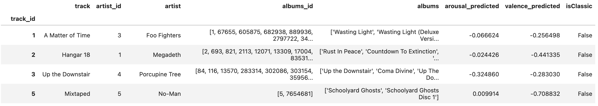
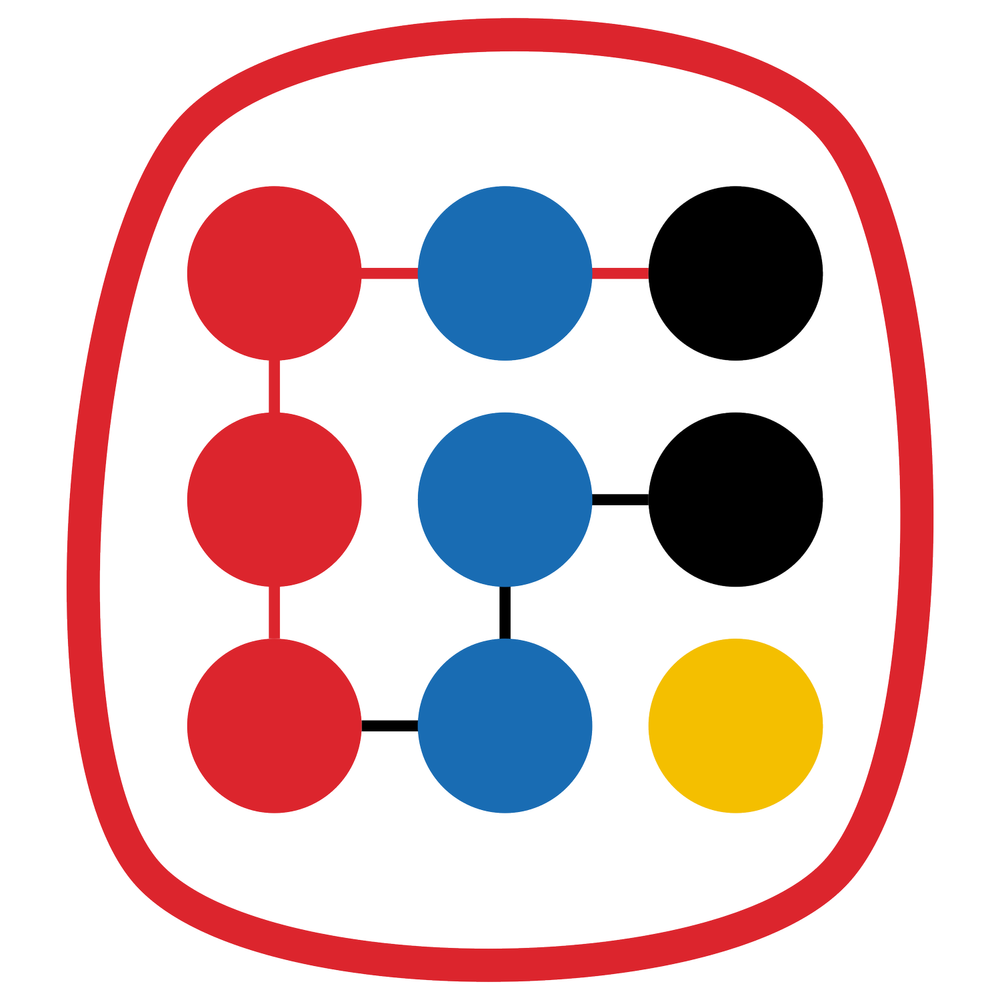

# EvalRS-KDD-2023
Official Repository for EvalRS @ KDD 2023, the Second Edition of the workshop on
well-rounding the evaluation of recommender systems.

<a href="https://colab.research.google.com/drive/1QeXglfCUEcscHB6L0Gch2qDKDDlfwLlq?usp=sharing">   </a>

[//]: # (TODO: we really need a new image!)


## Quick Start

| Name            | Link     | 
|-----------------|----------|
| Tutorial 1 - Exploring the EvalRS Dataset | [](https://colab.research.google.com/drive/1VXmCpL0YkLkf5_GTgJmLtd2b2A57CNjm?usp=sharing)|
| Tutorial 2 - A Dummy Model In RecList on the EvalRS Dataset  | [](https://colab.research.google.com/drive/1QeXglfCUEcscHB6L0Gch2qDKDDlfwLlq?usp=sharing)|


## Overview

This is the official repository for [EvalRS @ KDD 2023](https://reclist.io/kdd2023-cup/): _a Well-Rounded Evaluation of Recommender Systems_.

Aside from papers and talks, we will host a hackathon, where participants will pursue innovative projects for the rounded evaluation of recommender systems. The aim of the hackathon is to evaluate recommender systems across a set of important dimensions (accuracy being _one_ of them) through a principled and re-usable set of abstractions, as provided by [RecList](https://github.com/jacopotagliabue/reclist) 🚀. At the end of the workshop, organizers will sponsor a social event for teams to finalize their projects, mingle with like-minded practitioners and received the monetary prizes for best papers and projects: a link to the event will be added soon!

This repository provides an open dataset and all the tools necessary to partecipate in the hackathon: everything will go back to the community as open-source contributions. Please refer to the appropriate sections below to know how to get the dataset and run the evaluation loop properly.

All accepted papers for EvalRS are available [here](https://github.com/RecList/evalRS-KDD-2023/tree/main/papers).

### Important dates

Check the [EvalRS website](https://reclist.io/kdd2023-cup/) for the official timeline, including the start date, paper submission, and workshop day.

### Quick links

* 🛖 [EvalRS website](https://reclist.io/kdd2023-cup/)
* 📚 [EvalRS paper](https://arxiv.org/abs/2304.07145)
* 📖 [RecList website](https://reclist.io/)


## Dataset and target scenario

This hackathon is based on the [LFM-1b Dataset, Corpus of Music Listening Events for Music Recommendation](http://www.cp.jku.at/datasets/LFM-1b/). The use case is a typical user-item recommendation scenario: at _prediction time_, we have a set of target users to which we need to recommend a set of songs to listen to. To achieve that, we have historical anonymous data on previous music consumptions from users in the same setting.

We picked LFM as it suits the spirit and the goal of this event: in particular, thanks to [rich meta-data on users](http://www.cp.jku.at/people/schedl/Research/Publications/pdf/schedl_ijmir_2017.pdf), the dataset allows us to test recommender systems among many non-obvious dimensions, on top of standard Information Retrieval Metrics (for the philosophy behind behavioral testing, please refer to the original [RecList paper](https://arxiv.org/abs/2111.09963)).

Importantly, this dataset is _new_: to provide richer [meta-data](https://arxiv.org/abs/1912.02477), we have extended the LFM-1b dataset with content-based features and user-provided labels from the [WASABI dataset](https://github.com/micbuffa/WasabiDataset) (see below).

### Dataset overview

When you run the evaluation loop below, the code will automatically download _a chosen subset of the LFM dataset_, ready to be used (the code will download it only the first time you run it). There are three main objects available from the provided evaluation class:

_Users_: a collection of users and available meta-data, including patterns of consumption, demographics etc... In the Data Challenge scenario, the user Id is the query item for the model, which is asked to recommend songs to the user.


_Tracks_: a collection of tracks and available meta-data. In the Data Challenge scenario, tracks are the target items for the model, i.e. the collection to choose from when the model needs to provide recommendations.



[//]: # (TODO: add one more picture on the extra fields and their coverage)

_Historical Interactions_: a collection of interactions between users and tracks, that is, listening events, which should be used by your model to build the recommender system for the Data Challenge.


For in-depth explanations of the code and the template scripts, see the instructions below and check the provided examples and tutorials in `notebooks`.

For information on how the original dataset was built and what meta-data are available, please refer to [this paper](http://www.cp.jku.at/people/schedl/Research/Publications/pdf/schedl_ijmir_2017.pdf).

[//]: # (TODO: add a reference to the notebook used to merge the two datasets)

## Hack with us

You can refer to our collab notebooks to start playing with the dataset and to run a first, very simple model, with RecList.

| Name            | Link     | 
|-----------------|----------|
| Tutorial 1 - Exploring the EvalRS Dataset | [](https://colab.research.google.com/drive/1VXmCpL0YkLkf5_GTgJmLtd2b2A57CNjm?usp=sharing)|
| Tutorial 2 - A Dummy Model In RecList on the EvalRS Dataset  | [](https://colab.research.google.com/drive/1QeXglfCUEcscHB6L0Gch2qDKDDlfwLlq?usp=sharing)|

## Hackathon Structure and Rules

### How the Hackathon runs

We will ask participants to come up with a contribution for the rounded evaluation of recommender systems, based on the dataset and tools available in this repository. Contribution details will be intentionally left open-ended, as we would like participants to engage different angles of the problem on a shared set of resources. 

Examples could be operationalizing important notions of robustness, applying and discussing metric definitions from literature, quantifying the trade-off between privacy and accuracy, and so on. The hackathon is a unique opportunity to **live and breathe** the workshop themes, increase chances of multi-disciplinary collaboration, network and discover related work by peers, and contribute valuable materials back to the community. 

### Rules

* The hackathon will start during the workshop and continue at the social gathering.
* Remote teams that are not able to join KDD in person can participate to the hackathon if willing to operate during the workshop hours: please send a message to `claudio dot pomo at poliba dot it` and `fede at stanford dot edu` if you're interested in partecipating remotely.
* Teams can start working on their project before KDD, provided they will also work during the event and engage the other participants during the workshop.
* The only dataset that can be used is the one provided with this repository (you can, of course, _augment_ it if you see fit): given the open-ended nature of the challenge, we are happy for participants to choose whatever tool they desire: for example, you can bring your own model or use the ones we provide if the point you are making is independent from any modelling choice. Please note that if you focus on offline code-based evaluation, re-using and extending the provided RecList provides bonus points, as our goal is to progressively standardize testing through a common library.
* The deliverables for each team are two: 1) a public GitHub repository with an open source license containing whatever has been used for the project (e.g. code, materials, slides, charts); 2) a video elevator pitch of at <3 minutes during which the team explains (using whatever narrative device: a demo, a demo and some slides, animations etc.) their project: motivation, execution, learnings and why it is cool.
* Based on the materials submitted and the elevator pitch, the organizers will determine the winners at their sole discretion and award the prizes at the social event the evening of Aug. 7th (location TBD).

### Prizes

Here is the breakdown of the prizes that will be awarded:

* $500 best student paper
* $500 best paper
* $500 runner-up best hackathon project
* $2000 best hackathon project

The prizes are generously offered by _mozilla.ai_: winners should contact `fahd at mozilla dot ai` for the delivery.

## Organizers

This workshop focuses on building in the open, and adding lasting artifacts to the community. _EvalRS @ KDD 2023_ is a collaboration between practitioners from industry and academia, who joined forces to make it happen:

* Federico Bianchi, Stanford
* Patrick John Chia, Coveo
* Jacopo Tagliabue, NYU / Bauplan
* Claudio Pomo, Politecnico di Bari
* Gabriel de Souza P. Moreira, NVIDIA
* Ciro Greco, Bauplan
* Davide Eynard, mozilla.ai
* Fahd Husain, mozilla.ai

## Sponsors

This Data Challenge is open and possible thanks to the generous support of these awesome folks. Make sure to add a star to [our library](https://github.com/jacopotagliabue/reclist) and check them out!


<a href="https://mozilla.ai/" target="_blank">
    
</a>

<a href="https://snap.com/en-US" target="_blank">
    
</a>

<a href="https://www.bauplanlabs.com/" target="_blank">
    
</a>

<a href="https://costanoa.vc/" target="_blank">
    
</a>

## How to Cite

If you find our code, datasets, tests useful in your work, please cite the original WebConf contribution as well as the EvalRS paper.

_RecList_

```
@inproceedings{10.1145/3487553.3524215,
    author = {Chia, Patrick John and Tagliabue, Jacopo and Bianchi, Federico and He, Chloe and Ko, Brian},
    title = {Beyond NDCG: Behavioral Testing of Recommender Systems with RecList},
    year = {2022},
    isbn = {9781450391306},
    publisher = {Association for Computing Machinery},
    address = {New York, NY, USA},
    url = {https://doi.org/10.1145/3487553.3524215},
    doi = {10.1145/3487553.3524215},
    pages = {99–104},
    numpages = {6},
    keywords = {recommender systems, open source, behavioral testing},
    location = {Virtual Event, Lyon, France},
    series = {WWW '22 Companion}
}
```

_EvalRS_

```
@misc{https://doi.org/10.48550/arXiv.2304.07145,
  doi = {10.48550/ARXIV.2304.07145},
  url = {https://arxiv.org/abs/2304.07145},
  author = {Federico Bianchi and Patrick John Chia and Ciro Greco and Claudio Pomo and Gabriel Moreira and Davide Eynard and Fahd Husain and Jacopo Tagliabue},
  title = {EvalRS 2023. Well-Rounded Recommender Systems For Real-World Deployments},
  publisher = {arXiv},
  year = {2023},
  copyright = {Creative Commons Attribution 4.0 International}
}
```
